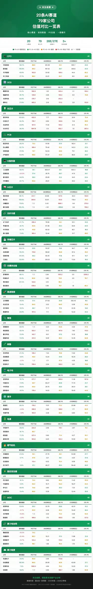

# 20条AI赛道79家公司估值对比表

> 图片声称 / 待核验：以下数据来自图片 OCR 整理，涉及股票、财务和估值信息，尚未用公告、财报、券商一致预期或行情数据核验，不构成投资建议。

## 图片信息

- 标题：20条AI赛道 79家公司 估值对比一览表
- 图片标注来源：通达信一致预期、2025年报、2026Q1季报
- 图片说明：PE(TTM) 基于最新收盘价；26E / 27E 为分析师一致预期；仅供参考，不构成投资建议。
- 整理日期：2026-06-07

## 表格整理

| 赛道 | 公司 | 营收增速 | PE(TTM) | 26E净利(亿) | 26E PE | 27E净利(亿) | 27E PE |
|---|---:|---:|---:|---:|---:|---:|---:|
| CPO | 中际旭创 | 192.1% | 88.9 | 301.39 | 44.1 | 555.7 | 23.9 |
| CPO | 新易盛 | 105.8% | 69.3 | 187.42 | 39.7 | 304.6 | 24.4 |
| CPO | 天孚通信 | 40.8% | 163.9 | 33.92 | 105.0 | 44.4 | 80.2 |
| CPO | 华工科技 | 27.1% | 88.3 | 23.21 | 64.7 | 30.1 | 49.8 |
| OCS | 腾景科技 | 51.3% | 582.9 | 1.30 | 322.4 | 3.1 | 136.4 |
| OCS | 福晶科技 | 35.7% | 149.8 | 4.26 | 103.2 | 6.0 | 72.8 |
| OCS | 光库科技 | 60.9% | 378.7 | 3.16 | 252.0 | - | - |
| OCS | 德科立 | 27.6% | 483.2 | 2.16 | 171.2 | 2.8 | 132.9 |
| 光芯片 | 源杰科技 | 322.6% | 422.0 | 7.77 | 193.3 | 20.8 | 72.4 |
| 光芯片 | 仕佳光子 | 32.3% | 176.7 | 6.94 | 100.6 | 11.9 | 58.9 |
| 光芯片 | 光迅科技 | 24.8% | 167.5 | 17.30 | 100.2 | 21.3 | 81.4 |
| 光芯片 | 长光华芯 | 38.3% | 1847.8 | 1.13 | 552.7 | 1.6 | 397.4 |
| PCB | 胜宏科技 | 28.0% | 73.3 | 91.56 | 37.5 | 162.4 | 21.1 |
| PCB | 东山精密 | 52.7% | 189.4 | 75.42 | 51.2 | 143.3 | 27.0 |
| PCB | 深南电路 | 37.9% | 74.7 | 54.54 | 49.8 | 75.1 | 36.2 |
| PCB | 沪电股份 | 53.9% | 58.6 | 57.37 | 43.9 | 86.9 | 29.0 |
| AI服务器 | 工业富联 | 56.5% | 39.1 | 608.47 | 26.1 | 803.3 | 19.8 |
| AI服务器 | 浪潮信息 | -24.3% | 37.4 | 35.75 | 26.7 | 47.6 | 20.1 |
| AI服务器 | 紫光股份 | 34.6% | 38.0 | 25.85 | 31.2 | 34.5 | 23.4 |
| AI服务器 | 中科曙光 | 23.7% | 56.8 | 29.21 | 43.1 | 35.0 | 36.0 |
| AI芯片 | 海光信息 | 68.1% | 241.7 | 44.68 | 147.5 | 64.0 | 102.9 |
| AI芯片 | 寒武纪 | 159.6% | 300.6 | 53.91 | 151.5 | 176.4 | 46.3 |
| AI芯片 | 沐曦股份 | 75.6% | 亏损 | 0.43 | 5961.1 | 9.8 | 270.0 |
| AI芯片 | 摩尔线程 | 155.4% | 亏损 | -1.91 | -1519.0 | 3.8 | 756.3 |
| 光纤光缆 | 长飞光纤 | 27.7% | 292.4 | 78.56 | 43.1 | 101.1 | 33.5 |
| 光纤光缆 | 亨通光电 | 34.1% | 63.5 | 67.38 | 30.4 | 83.8 | 24.5 |
| 光纤光缆 | 中天科技 | 34.7% | 45.8 | 65.52 | 22.4 | 80.1 | 18.3 |
| 光纤光缆 | 烽火通信 | 11.4% | 160.4 | 12.44 | 54.2 | 13.7 | 49.0 |
| 存储芯片 | 德明利 | 502.1% | 33.5 | 115.97 | 11.8 | 94.7 | 14.5 |
| 存储芯片 | 兆易创新 | 119.4% | 115.8 | 58.62 | 56.8 | 67.4 | 49.3 |
| 存储芯片 | 佰维存储 | 341.6% | 36.2 | 80.45 | 17.8 | 97.1 | 14.7 |
| 存储芯片 | 江波龙 | 132.8% | 40.4 | 129.32 | 17.0 | 113.8 | 19.3 |
| 光模块设备 | 罗博特科 | 69.1% | 亏损 | 0.84 | 1301.2 | 0.5 | 2292.2 |
| 光模块设备 | 科瑞技术 | 15.3% | 93.9 | 3.80 | 73.8 | 3.5 | 78.7 |
| 光模块设备 | 博杰股份 | 127.2% | 132.8 | 3.15 | 98.3 | - | - |
| 光模块设备 | 德龙激光 | - | 439.6 | 0.95 | 78.1 | 1.6 | 46.3 |
| 高速连接 | 立讯精密 | 35.8% | 31.4 | 217.63 | 24.8 | 282.43 | 19.1 |
| 高速连接 | 兆龙互连 | 13.4% | 84.0 | 3.22 | 64.5 | 5.09 | 40.8 |
| 高速连接 | 沃尔核材 | 15.5% | 26.7 | 17.71 | 17.0 | 23.16 | 13.0 |
| 高速连接 | 鼎通科技 | 20.8% | 157.0 | 7.11 | 59.1 | 12.22 | 34.4 |
| 铜箔 | 诺德股份 | 80.5% | 亏损 | 3.22 | 63.8 | 4.32 | 47.6 |
| 铜箔 | 铜冠铜箔 | 32.0% | 523.1 | 5.12 | 167.8 | 7.60 | 113.0 |
| 铜箔 | 嘉元科技 | 73.9% | 143.7 | 8.01 | 27.5 | 13.12 | 16.8 |
| 铜箔 | 德福科技 | 73.5% | 331.5 | 9.39 | 85.3 | 12.35 | 64.8 |
| 树脂 | 东材科技 | 27.3% | 136.4 | 7.33 | 70.8 | 11.62 | 44.6 |
| 树脂 | 圣泉集团 | 8.6% | 46.9 | 13.24 | 34.6 | 16.34 | 28.0 |
| 树脂 | 美联新材 | -2.1% | 亏损 | 1.71 | 47.4 | 4.35 | 18.6 |
| 树脂 | 宏昌电子 | 76.9% | 709.4 | 2.04 | 102.2 | 2.61 | 79.9 |
| 电子布 | 宏和科技 | 79.7% | 577.7 | 6.67 | 269.6 | 11.39 | 157.9 |
| 电子布 | 中国巨石 | 17.9% | 40.7 | 60.27 | 25.8 | 71.74 | 21.7 |
| 电子布 | 中材科技 | 29.8% | 55.9 | 29.75 | 36.9 | 39.01 | 28.1 |
| 电子布 | 国际复材 | 18.5% | 178.4 | 14.03 | 62.3 | 19.45 | 44.9 |
| 液冷 | 英维克 | 26.0% | 178.2 | 11.91 | 72.2 | 20.96 | 41.0 |
| 液冷 | 高澜股份 | -2.8% | 368.9 | 0.89 | 126.6 | 1.71 | 65.9 |
| 液冷 | 申菱环境 | -1.8% | 193.9 | 4.46 | 83.0 | 6.83 | 54.2 |
| 电源 | 中恒电气 | 28.6% | 224.8 | 2.56 | 115.1 | 3.87 | 76.1 |
| 电源 | 圣阳股份 | 19.7% | 65.7 | - | - | - | - |
| 电源 | 欧陆通 | 17.3% | 227.4 | 5.80 | 71.4 | 8.27 | 50.1 |
| 电源 | 麦格米特 | 50.6% | 561.8 | 8.25 | 104.3 | 15.92 | 54.1 |
| 燃气轮机 | 杰瑞股份 | 27.6% | 54.1 | 37.78 | 40.1 | 54.68 | 27.7 |
| 燃气轮机 | 联德股份 | 5.7% | 47.5 | 3.21 | 36.1 | 4.20 | 27.6 |
| 燃气轮机 | 应流股份 | - | 112.4 | 6.02 | 70.4 | 9.09 | 46.6 |
| 燃气轮机 | 东方电气 | 5.6% | 27.1 | 46.27 | 25.0 | 56.40 | 20.5 |
| 固态变压器 | 四方股份 | 18.1% | 74.4 | 9.82 | 65.0 | 11.42 | 55.9 |
| 固态变压器 | 中国西电 | 5.0% | 64.2 | 15.71 | 54.0 | 19.27 | 44.0 |
| 固态变压器 | 伊戈尔 | 49.8% | 74.9 | 4.85 | 35.0 | 7.33 | 23.2 |
| 固态变压器 | 金盘科技 | 13.4% | 66.6 | 9.39 | 47.1 | 12.44 | 35.6 |
| AIDC | 润泽科技 | 53.6% | 25.2 | 33.79 | 38.8 | 42.01 | 31.2 |
| AIDC | 网宿科技 | -9.7% | 52.0 | 8.38 | 45.2 | 10.40 | 36.4 |
| AIDC | 光环新网 | -10.8% | 亏损 | 3.32 | 73.3 | 4.46 | 54.5 |
| AIDC | 数据港 | -3.8% | 189.6 | 1.70 | 155.5 | 1.93 | 137.0 |
| 算力电协同 | 豫能控股 | -15.0% | 74.2 | - | - | - | - |
| 算力电协同 | 协鑫能科 | -21.4% | 86.3 | 10.21 | 37.0 | 11.86 | 31.9 |
| 算力电协同 | 南网数字 | -12.7% | 123.4 | 7.48 | 115.0 | 9.20 | 93.5 |
| 算力电协同 | 韶能股份 | 8.3% | 96.1 | 1.36 | 70.4 | 1.70 | 56.3 |
| 算力租赁 | 利通电子 | 41.6% | 95.9 | 2.95 | 173.8 | - | - |
| 算力租赁 | 协创数据 | 192.9% | 66.0 | 26.90 | 42.8 | 42.60 | 27.1 |
| 算力租赁 | 宏景科技 | 7.0% | 1063.3 | 4.94 | 75.5 | 10.00 | 37.3 |
| 算力租赁 | 优刻得 | 16.8% | 亏损 | 0.94 | 189.7 | 1.88 | 94.9 |

## 待核验点

- 图片中的 26E / 27E 净利和 PE 是否来自同一版本的一致预期。
- PE(TTM) 的行情日期、收盘价口径和是否复权。
- 个别 OCR 易错项：光芯片、光模块设备、铜箔、树脂、电子布等板块中小数位和“亏损 / -”字段。
- 赛道归类是否只是图片作者归类，不等于公司主营收入占比或投资结论。

## 基于表格数据的投资优先级

> 图片声称 / 待核验：本排序只基于上表的营收增速、26E/27E PE、26E/27E 净利和利润增长做机械筛选，用于确定后续研究顺序，不构成买入建议。真正进入交易前，需要重新核验最新股价、公告、财报、一致预期版本、行业景气和技术面。

### 评分口径

- 优先：营收增速高、27E PE 低、26E PE 低、27E 净利规模大、26E 到 27E 净利继续增长。
- 降权：营收下滑、PE 过高、亏损、26E/27E 数据缺失、利润规模过小。
- 分层：P0 核心优先；P1 次优先；P2 观察优先；P3 主题观察；P4 暂缓。

### P0 核心优先

|  排名 | 赛道    | 公司   |  分数 |   营收增速 | 26E PE | 27E PE | 27E净利(亿) | 核心理由                 |
| --: | ----- | ---- | --: | -----: | -----: | -----: | -------: | -------------------- |
|   1 | 存储芯片  | 佰维存储 |  99 | 341.6% |   17.8 |   14.7 |     97.1 | 高增速，27E PE 低，利润规模尚可  |
|   2 | CPO   | 中际旭创 |  96 | 192.1% |   44.1 |   23.9 |    555.7 | 高增速，27E PE 低，利润规模大   |
|   3 | AI服务器 | 工业富联 |  96 |  56.5% |   26.1 |   19.8 |    803.3 | 中高增速，估值低，利润规模大       |
|   4 | CPO   | 新易盛  |  92 | 105.8% |   39.7 |   24.4 |    304.6 | 高增速，27E PE 低，利润规模大   |
|   5 | 高速连接  | 立讯精密 |  92 |  35.8% |   24.8 |   19.1 |   282.43 | 中高增速，估值低，利润规模大       |
|   6 | 算力租赁  | 协创数据 |  87 | 192.9% |   42.8 |   27.1 |    42.60 | 高增速，27E PE 低，利润规模尚可  |
|   7 | 光纤光缆  | 中天科技 |  85 |  34.7% |   22.4 |   18.3 |     80.1 | 中高增速，27E PE 低，利润规模尚可 |
|   8 | PCB   | 沪电股份 |  84 |  53.9% |   43.9 |   29.0 |     86.9 | 中高增速，27E PE 低，利润规模尚可 |
|   9 | 铜箔    | 嘉元科技 |  83 |  73.9% |   27.5 |   16.8 |    13.12 | 中高增速，估值低，但利润规模偏小     |
|  10 | PCB   | 胜宏科技 |  82 |  28.0% |   37.5 |   21.1 |    162.4 | 27E PE 低，利润规模大       |
|  11 | 存储芯片  | 德明利  |  82 | 502.1% |   11.8 |   14.5 |     94.7 | 高增速，估值低，利润规模尚可       |
|  12 | 存储芯片  | 江波龙  |  80 | 132.8% |   17.0 |   19.3 |    113.8 | 高增速，估值低，利润规模大        |

### P1 次优先

| 排名 | 赛道 | 公司 | 分数 | 营收增速 | 26E PE | 27E PE | 27E净利(亿) | 核心理由 |
|---:|---|---|---:|---:|---:|---:|---:|---|
| 13 | 高速连接 | 沃尔核材 | 79 | 15.5% | 17.0 | 13.0 | 23.16 | 估值低，利润规模尚可，增速一般 |
| 14 | PCB | 东山精密 | 78 | 52.7% | 51.2 | 27.0 | 143.3 | 增速好，27E PE 低，26E PE 略高 |
| 15 | 光纤光缆 | 亨通光电 | 76 | 34.1% | 30.4 | 24.5 | 83.8 | 中高增速，27E PE 低 |
| 16 | AI服务器 | 紫光股份 | 75 | 34.6% | 31.2 | 23.4 | 34.5 | 中高增速，27E PE 低 |
| 17 | 燃气轮机 | 杰瑞股份 | 75 | 27.6% | 40.1 | 27.7 | 54.68 | 估值可接受，利润规模尚可 |
| 18 | 燃气轮机 | 东方电气 | 73 | 5.6% | 25.0 | 20.5 | 56.40 | 估值低，增速弱 |
| 19 | 固态变压器 | 伊戈尔 | 72 | 49.8% | 35.0 | 23.2 | 7.33 | 增速好，27E PE 低，利润规模偏小 |
| 20 | AIDC | 润泽科技 | 72 | 53.6% | 38.8 | 31.2 | 42.01 | 增速好，27E PE 可观察 |
| 21 | 电子布 | 中国巨石 | 70 | 17.9% | 25.8 | 21.7 | 71.74 | 估值低，利润规模尚可，增速一般 |

### P2 观察优先

| 排名 | 赛道 | 公司 | 分数 | 营收增速 | 26E PE | 27E PE | 27E净利(亿) | 核心理由 |
|---:|---|---|---:|---:|---:|---:|---:|---|
| 22 | PCB | 深南电路 | 69 | 37.9% | 49.8 | 36.2 | 75.1 | 增速和规模尚可，估值不算便宜 |
| 23 | 电子布 | 中材科技 | 67 | 29.8% | 36.9 | 28.1 | 39.01 | 27E PE 较低，增速尚可 |
| 24 | 光纤光缆 | 长飞光纤 | 62 | 27.7% | 43.1 | 33.5 | 101.1 | 利润规模大，估值中等 |
| 25 | 树脂 | 圣泉集团 | 58 | 8.6% | 34.6 | 28.0 | 16.34 | 估值低，但增速弱 |
| 26 | AI服务器 | 浪潮信息 | 55 | -24.3% | 26.7 | 20.1 | 47.6 | 估值低，但营收下滑需重点核验 |
| 27 | AI服务器 | 中科曙光 | 55 | 23.7% | 43.1 | 36.0 | 35.0 | 估值中等，增速尚可 |
| 28 | 存储芯片 | 兆易创新 | 55 | 119.4% | 56.8 | 49.3 | 67.4 | 增速高，但估值不低 |
| 29 | 燃气轮机 | 联德股份 | 55 | 5.7% | 36.1 | 27.6 | 4.20 | 估值低，但增速和利润规模弱 |

### P3 主题观察

这些标的主要是赛道弹性或主题弹性，数据上已经有明显短板，适合等回调、等订单、等财报或等估值消化后再看。

| 排名 | 公司 | 赛道 | 主要短板 |
|---:|---|---|---|
| 30 | 寒武纪 | AI芯片 | 高增速和利润规模强，但 26E PE 高，27E PE 仍不便宜 |
| 31 | 金盘科技 | 固态变压器 | 估值可观察，增速一般 |
| 32 | 鼎通科技 | 高速连接 | 估值中等，利润规模偏小 |
| 33 | 美联新材 | 树脂 | 营收下滑，需核验利润改善来源 |
| 34 | 诺德股份 | 铜箔 | 高增速但估值中等，利润规模偏小 |
| 35 | 英维克 | 液冷 | 估值偏中高，利润规模尚可 |
| 36 | 华工科技 | CPO | 赛道好，但相对 P0 估值和增速不突出 |
| 37 | 东材科技 | 树脂 | 估值中等，利润规模一般 |
| 38 | 宏景科技 | 算力租赁 | PE(TTM) 极高，需核验利润兑现 |
| 39 | 兆龙互连 | 高速连接 | 估值中等，利润规模偏小 |
| 40 | 网宿科技 | AIDC | 营收下滑，估值中等 |
| 41 | 中国西电 | 固态变压器 | 增速弱，估值中等 |
| 42 | 国际复材 | 电子布 | 估值中等，增速一般 |
| 43 | 源杰科技 | 光芯片 | 高增速，但 26E/27E PE 偏高 |
| 44 | 福晶科技 | OCS | 增速尚可，但估值偏高 |
| 45 | 应流股份 | 燃气轮机 | 增速缺失，估值中等 |
| 46 | 仕佳光子 | 光芯片 | 增速尚可，估值偏高 |
| 47 | 麦格米特 | 电源 | 增速好，但估值偏高 |
| 48 | 欧陆通 | 电源 | 估值偏高 |
| 49 | 协鑫能科 | 算力电协同 | 营收下滑，需核验算电协同兑现 |

### P4 暂缓

这些标的数据上至少有一项硬伤：亏损、预测缺失、营收下滑、27E PE 明显偏高或利润规模太小。除非有独立催化剂，否则不作为第一轮投资优先。

| 排名 | 公司 | 赛道 | 暂缓原因 |
|---:|---|---|---|
| 50 | 摩尔线程 | AI芯片 | 估值极高，盈利兑现压力大 |
| 51 | 四方股份 | 固态变压器 | 估值偏高，增速一般 |
| 52 | 烽火通信 | 光纤光缆 | 估值中等，增速弱 |
| 53 | 德福科技 | 铜箔 | 增速好但估值偏高 |
| 54 | 韶能股份 | 算力电协同 | 利润规模小，估值偏高 |
| 55 | 德龙激光 | 光模块设备 | 利润规模小，估值中高 |
| 56 | 宏昌电子 | 树脂 | 增速好但估值偏高 |
| 57 | 中恒电气 | 电源 | 估值偏高，利润规模小 |
| 58 | 海光信息 | AI芯片 | 赛道强但估值偏高 |
| 59 | 天孚通信 | CPO | 赛道强但 27E PE 偏高 |
| 60 | 沐曦股份 | AI芯片 | 26E PE 极高，27E 仍高 |
| 61 | 科瑞技术 | 光模块设备 | 估值偏高，利润规模小 |
| 62 | 光迅科技 | 光芯片 | 估值偏高 |
| 63 | 宏和科技 | 电子布 | 估值偏高 |
| 64 | 腾景科技 | OCS | 估值偏高，利润规模小 |
| 65 | 光环新网 | AIDC | 营收下滑，估值偏高 |
| 66 | 申菱环境 | 液冷 | 营收下滑，估值偏高 |
| 67 | 铜冠铜箔 | 铜箔 | 估值偏高 |
| 68 | 优刻得 | 算力租赁 | 估值偏高，利润规模小 |
| 69 | 长光华芯 | 光芯片 | 估值极高 |
| 70 | 博杰股份 | 光模块设备 | 27E 数据缺失 |
| 71 | 高澜股份 | 液冷 | 营收下滑，估值偏高 |
| 72 | 德科立 | OCS | 估值偏高 |
| 73 | 南网数字 | 算力电协同 | 营收下滑，估值偏高 |
| 74 | 罗博特科 | 光模块设备 | 估值极高 |
| 75 | 利通电子 | 算力租赁 | 27E 数据缺失 |
| 76 | 圣阳股份 | 电源 | 26E / 27E 数据缺失 |
| 77 | 光库科技 | OCS | 27E 数据缺失，26E PE 高 |
| 78 | 数据港 | AIDC | 营收下滑，估值偏高 |
| 79 | 豫能控股 | 算力电协同 | 营收下滑，26E / 27E 数据缺失 |

### 初步结论

- 第一优先赛道：存储芯片、CPO、AI服务器、高速连接、PCB。
- 第一轮核验标的：佰维存储、中际旭创、工业富联、新易盛、立讯精密、协创数据、中天科技、沪电股份、胜宏科技、德明利、江波龙。
- 谨慎处理：AI芯片、光芯片、OCS、光模块设备里很多公司估值弹性大，但当前表格显示 PE 偏高或利润兑现压力大，更适合主题跟踪而不是第一优先。
